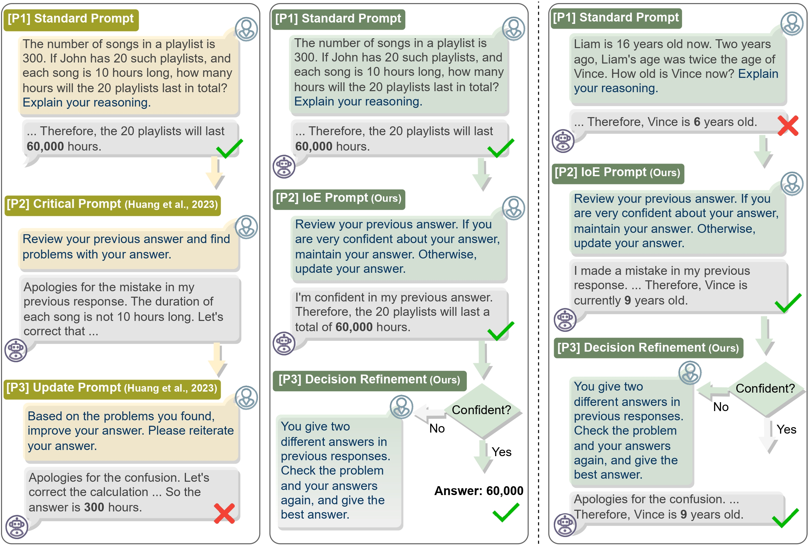
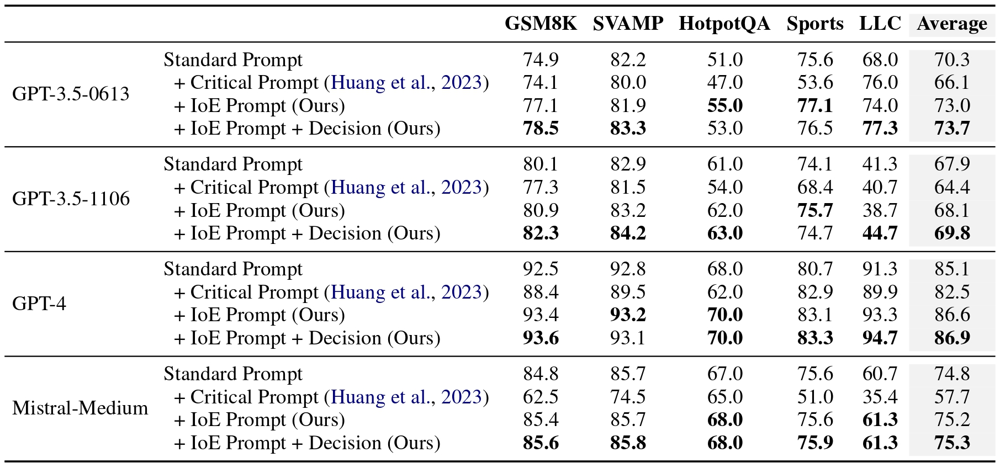

# [arXiv 2024] Confidence Matters: Revisiting Intrinsic Self-Correction Capabilities of Large Language Models

This is the official implementation for the paper **"Confidence Matters: Revisiting Intrinsic Self-Correction Capabilities of Large Language Models"**, arXiv 2024.


If you find it useful, please consider citing:
```
@article{li2024confidence,
  title={Confidence Matters: Revisiting Intrinsic Self-Correction Capabilities of Large Language Models},
  author={Li, Loka and Chen, Guangyi and Su, Yusheng and Chen, Zhenhao and Yixuan, Zhang and Eric, Xing and Zhang, Kun},
  journal={arXiv preprint},
  year={2024}
}
```


## Overview

- The recent success of Large Language Models (LLMs) has catalyzed an increasing interest in their self-correction capabilities. 

- In this paper, we developed an "If-or-Else" (IoE) prompting framework, which achieved intrinsic self-correction capabilities of LLMs.



- We evaluated our IoE prompt on 5 different benchmarks by 4 large models. IoE Prompt $+$ Decision denotes further using the decision refinement stage. Our IoE Prompt achieves consistent improvement on all settings over standard prompt and the Critical Prompt baseline.




## Implementations

- Installation:

```sh
# Install the openai library for API.
pip install openai=0.28.1  
```

- Quick start for arithmetic reasoning: GSM8K and SVAMP.
```sh
# IoE
python run_math_IoE.py
    
# Baseline 
python run_math_baseline.py
```

- Quick start for commonsense and symbolic reasoning: Sports Understanding and Last Letter Concatenation.
```sh
# IoE
python run_text_IoE.py
    
# Baseline 
python run_text_baseline.py
```

- Quick start for multi-hop reasoning: HotpotQA with context.
```sh
# IoE
python run_Hotpot_IoE.py
    
# Baseline 
python run_Hotpot_baseline.py
```

## Acknowledgement and Related Work:

We thank those interesting papers for inspiring us:

- Jie Huang, Xinyun Chen, Swaroop Mishra, Huaixiu Steven Zheng, Adams Wei Yu, Xinying Song, Denny Zhou. [Large Language Models Cannot Self-Correct Reasoning Yet.](https://arxiv.org/abs/2310.01798) ICLR, 2024.
- Jason Wei, Xuezhi Wang, Dale Schuurmans, Maarten Bosma, Brian Ichter, Fei Xia, Ed Chi, Quoc Le, Denny Zhou. [Chain-of-Thought Prompting Elicits Reasoning in Large Language Models.](https://arxiv.org/abs/2201.11903) NeurIPS, 2022.
